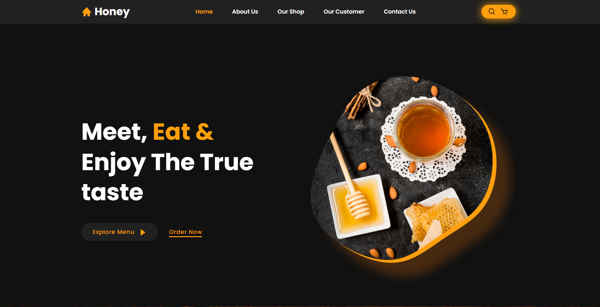

<h1 align="center"> Site de vendas de mel </h1>

  <a href="#-tecnologias">Tecnologias</a>&nbsp;&nbsp;&nbsp;|&nbsp;&nbsp;&nbsp;
  <a href="#-projeto">Projeto</a>&nbsp;&nbsp;&nbsp;&nbsp;&nbsp;&nbsp;

 

  

## Tecnologias

Esse projeto foi desenvolvido com as seguintes tecnologias:

- HTML
- CSS
- JavaScript

## 💻 Projeto

O website "Honey" é uma plataforma online que combina elementos visuais atrativos com uma navegação intuitiva. Composto por seções como Home, About Us, Our Shop, Reviews e Contact, o site oferece aos visitantes uma experiência completa. Os usuários podem explorar os produtos disponíveis na loja, conhecer mais sobre a empresa, ler feedbacks de clientes satisfeitos e contatar a equipe facilmente. Além disso, o site incorpora recursos dinâmicos, como rolagem suave e um cabeçalho que permanece fixo durante a navegação, proporcionando uma experiência fluida e agradável aos usuários.
